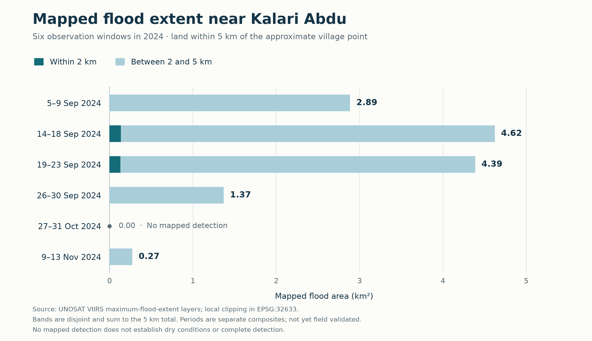
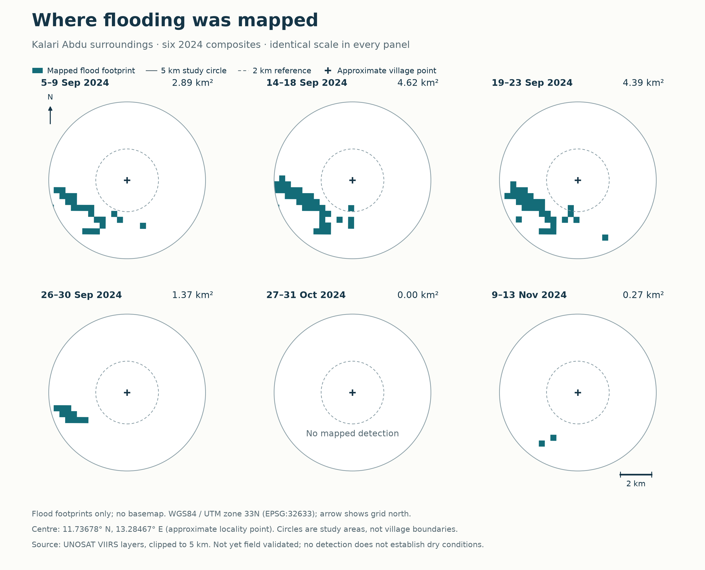

# Flooding near Kalari Abdu expanded in mid-September, then receded

**Ngadda River vicinity, Borno State, Nigeria · 5 September–13 November 2024**  
A local analysis of six UNOSAT VIIRS flood-mapping periods. Prepared 3 October 2026.

## Summary

Mapped flood extent within 5 km of Kalari Abdu reached **4.62 km²** during 14–18 September, approximately **60% above** 5–9 September. By 26–30 September, the mapped area had fallen to **1.37 km²**, about **70% below** that observed maximum. Across all six periods, **6.68 km²** appeared in at least one flood footprint. This combined footprint was not flooded simultaneously.

These findings establish the scale and changing distribution of mapped inundation near the village. They do not quantify people affected, damaged properties, flood depth, or economic losses.

## 1. The largest mapped extent occurred in mid-September

| Observation period, 2024 | Within 2 km (km²) | Within 5 km (km²) | Share of 5 km study area |
| :--- | ---: | ---: | ---: |
| 5–9 September | 0.00 | 2.89 | 3.7% |
| 14–18 September | 0.14 | 4.62 | 5.9% |
| 19–23 September | 0.13 | 4.39 | 5.6% |
| 26–30 September | 0.00 | 1.37 | 1.7% |
| 27–31 October | 0.00 | 0.00 | 0.0% |
| 9–13 November | 0.00 | 0.27 | 0.3% |

The 5 km circle covers 78.54 km² and includes the 2 km circle. These columns must not be added. The October value means **no mapped detection**, not proof that the area was dry. The largest observed period is not necessarily the event's true peak; the observations have gaps.

## 2. Similar totals concealed changes in location

Between 14–18 and 19–23 September, total extent declined by only **5.1%**, but the footprint changed: **3.15 km²** appeared in both periods, **1.23 km²** appeared only in the later period, and **1.47 km²** appeared only in the earlier period. These are mapped changes, which may reflect both inundation changes and differences in detection.

A single total therefore misses locations where flooding newly appeared or was no longer detected. Repeated detections identify areas worth checking for recurring or persistent inundation; they do not measure uninterrupted time underwater.

## 3. Most of the observed maximum lay 2–5 km from the village point

At the observed maximum, **4.49 km²—about 97% of the mapped extent—lay in the 2–5 km ring**. Only 0.14 km² lay within 2 km. The affected footprint was concentrated in the surrounding landscape relative to the chosen point. The circles are analytical zones, not settlement boundaries, and this does not establish that the village itself was unaffected.

## What this means for flood impact

The study supports a local inundation-impact finding: mapped flooding expanded substantially, changed location, and largely receded by late September. UNOSAT's separate high-resolution assessment also identifies increased water along the Ngadda River near Kalari Abdu on 11 September. Its observations corroborate flooding in the vicinity, but are a different sensor and date from these VIIRS measurements. [UNOSAT assessment, page 5](https://unosat.org/static/unosat_filesystem/3967/UNOSAT_Preliminary_Assessment_Report_FL20240902NGA_Maiduguri_13Sep2024.pdf)

The footprint layers and change measurements provide a defensible basis for prioritizing checks of nearby access routes and assets. Any claim about road closure, damaged buildings, or affected residents would require those locations and independent impact evidence.

## Methods and limits

Flood polygons were intersected with circles around **11.73678° N, 13.28467° E**, an approximate [OpenStreetMap-derived village location](https://mapcarta.com/N5547360846). Areas use WGS84 / UTM zone 33N. Unique area is the spatial union of all six footprints, avoiding repeated counting.

All flood records are **not yet field validated**. No supplied cloud-obstruction polygons overlap the circles, but later-period analysis extents are unavailable for independent coverage checks. Multi-day composites and observation gaps prevent estimates of exact onset, peak day, or duration. The circles may include other water bodies, so these are not river-only measurements. Small mapped changes are sensitive to location and detection uncertainty; decimal precision is not measurement accuracy.

See [methods and sources](docs/METHODS.md), [data dictionary](docs/DATA_DICTIONARY.md), and [validation results](data/validation.json) for the supporting evidence.
